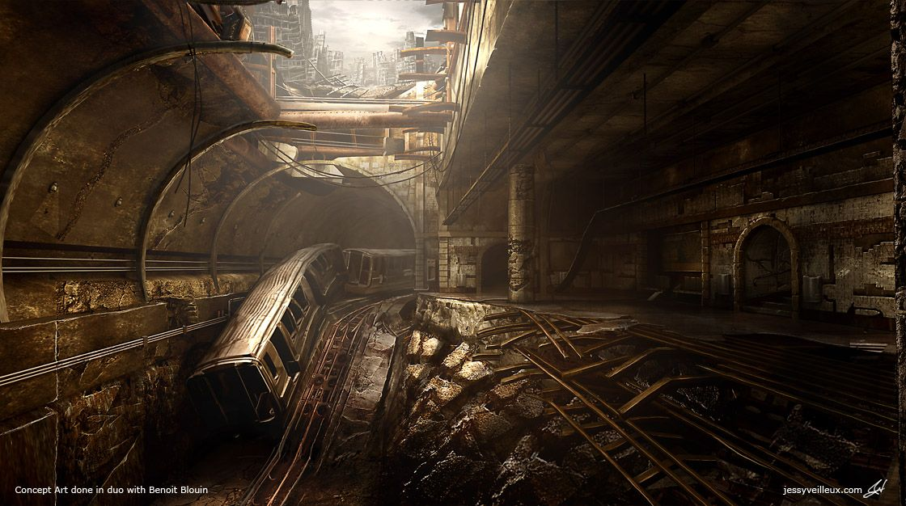

# Pilot experimentation

## [x__style_transfer__200208__02_02](http://guillaumeisabelle.com/nad-previz/2020/02/09/neural-style-transfer-x__style_transfer__200208__02_02-sh/)

* [Previous iteration results and code](http://guillaumeisabelle.com/nad-previz/2020/02/05/neural-style-transfer-x__style_transfer__200203-py/)

### SKY ONLY

### MOUNTAIN ONLY

### ALL (SKY + MOUNTAIN)

#### --@STCResults View
|       |       |       |       |       |
|  ---  |  ---  |  ---  |  ---  |  ---  |
|       |       |       |       |       |
|       |    x__style_transfer__200208__02_02a__all   |       |       |       |
|       |       |       |       |       |
|       |   x__style_transfer__200208__02_02a__mountain__stylized    |       |       |       |
|       |       |       |       |       |
|       |   x__style_transfer__200208__02_02a__sky__stylized    |       |       |       |
|       |       |       |       |       |
|       |   x__style_transfer__200208__02_02__var_2__all__stylized    |       |       |       |
|       |       |       |       |       |
|       |   x__style_transfer__200208__02_02__var_2__mountain__stylized    |       |       |       |
|       |       |       |       |       |
|       |   x__style_transfer__200208__02_02__var_2__sky__stylized    |       |       |       |
|       |       |       |       |       |
|       |    x__style_transfer__200208__02_02__var_3__all__stylized   |       |       |       |
|       |       |       |       |       |
|       |   x__style_transfer__200208__02_02__var_3__mountain__stylized    |       |       |       |
|       |       |       |       |       |
|       |    x__style_transfer__200208__02_02__var_3__sky__stylized   |       |       |       |

### --@STCGoal Model to present the results
* LAYERS Target Inputs
* Style
* Resulted of the NST

|       |   ALL    | MOUNTAIN       |SKY       |       |
|  ---  |  ---  |  ---  |  ---  |  ---  |
|       |       |        |       |       |

----

#### --@STCResults Var 1 Grid
* --@STCIssue The variation 1 is presented along with source style and each target input layer

|   Type    |   ALL    | MOUNTAIN       |SKY       |       |
|  ---  |  ---  |  ---  |  ---  |  ---  |
| In Render     |       |        |       |       |
|  Out : Stylized    |       |        |        |       |
|  In Style  |       |   Var 1       |       |       |

#### --@STCResults Var 2 Grid

|   Type    |   ALL    | MOUNTAIN       |SKY       |       |
|  ---  |  ---  |  ---  |  ---  |  ---  |
| In Render     |       |        |       |       |
|  Out : Stylized    |       |        |        |       |
|  In Style  |       |   **Var 2**       |       |       |

#### --@STCResults Var 3 Grid

|   Type    |   ALL    | MOUNTAIN       |SKY       |       |
|  ---  |  ---  |  ---  |  ---  |  ---  |
| In Render     |       |        |       |       |
|  Out : Stylized    |       |        |        |       |
|  In Style  |       |   **Var 3**       |       |       |

----
# Bellow are elements I used to create the presenting grid above.
----

#### --@STCTarget
|       |       |       |       |       |
|  ---  |  ---  |  ---  |  ---  |  ---  |
|       |       |        |       |       |
|       |   ALL    | MOUNTAIN       |SKY       |       |

##### Targets
|       |       |       |       |       |
|  ---  |  ---  |  ---  |  ---  |  ---  |
|       |       |       |       |       |
|       |       |    ALL   |       |       |
|       |   Mountain + Sky    |       |       |       |
|       |       |    MOUNTAIN   |       |       |
|       |   Mountain only    |       |       |       |
|       |       |    SKY   |       |       |
|       |   Sky only    |       |       |       |
|       |       |       |       |       |
|       |       |       |       |       |

#### STYLISTIC INPUTS

|       |   Var 1    | Var 2       | Var 3       |       |
|  ---  |  ---  |  ---  |  ---  |  ---  |
|       |       |        |        |       |
|       |      |       |       |       |
|       |      |       |       |       |

##### H
|       |       |       |       |       |
|  ---  |  ---  |  ---  |  ---  |  ---  |
|   Var 1    |       |       |       |       |
|   Var 2    |       |       |       |       |
|   Var 3    |       |       |       |       |
|       |       |       |       |       |
|       |       |       |       |       |

